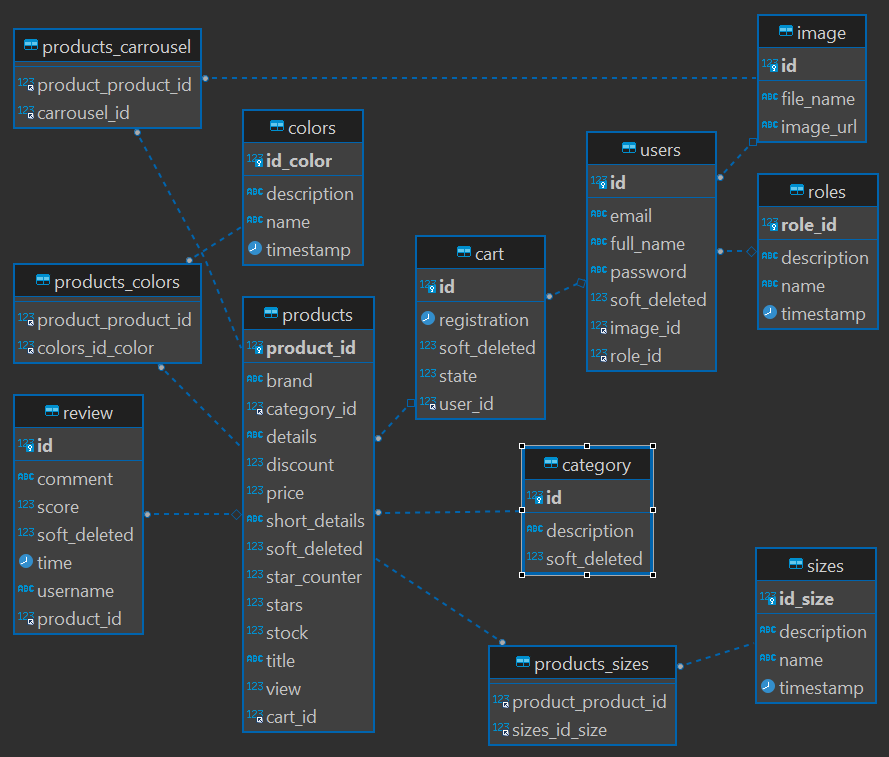

</img>
<h2>Proyecto: Ecommerce Ecológico Sport.</h2>

Es un ecommerce donde una empresa puede publicar su ropa ecológica y venderla, donde el admin puede cargar productos
con sus imágenes, crear categorías, actualizar datos,borrar productos y usuarios. 
El usuario puede buscar producto por categoría, precio, titulo ect, a su ves se puede loguear y registrar con la seguridad
por token y manejo de roles, seguidamente puede comprar y agregar productos al carrito y pagar por Paypal.

It is an ecommerce where a company can publish its ecological clothing and sell it, where the admin can upload products
with your images, create categories, update data, delete products and users. 
The user can search for a product by category, price, title, etc. At the same time, you can log in and register with security.
by token and role management, then you can buy and add products to the cart and pay by Paypal.
<h3>:computer: Tecnologías Back End </h3>

- ✅Java-11
- ✅Spring boot 2.7.4
- ✅lombok
- ✅Builder
- ✅Spring security
- ✅Programación funcional
- ✅Arquitectura en capas MVC
- ✅Swagger
- ✅JWT TOKEN
- ✅Base de datos Mysql
- ✅jpa-hibernate
- ✅AWS service para las imagenes
- ✅Paypal para el pago

<h3>:computer: Tecnologías Front End </h3>

- ✅ React
- ✅ Redux toolkit
- ✅ JavaScript

<h4>Diagrama ER</h4>

<h4>Deploy Back-End</h4>
- :heavy_check_mark: https://eco-sports.herokuapp.com/swagger-ui/index.html#/
<h4>Deploy Front-End</h4>
- :heavy_check_mark: https://s4-06-m-java-react-wljq.vercel.app/
<h4>Repositorio Front end</h4>
- :heavy_check_mark: https://github.com/No-Country/s4-06-m-java-react

<h5>Integrantes</h5>

- Diana Zambrano (_`UX/UI`_)
- Cristian Mosquera (_`Front end`_)
- Lucas Abdala (_`Front end`_)
- Santiago Schroh (_`Front end`_)
- Gabriel Navarro (_`Back end java`_)- :smirk:[gabynavarro](https://github.com/gabynavarro)
- Abel Acevedo (_`Back end java `_)- :sunglasses:[Abel3581](https://github.com/Abel3581)

<h5>Linkedin</h5>

- :space_invader:[Abel Acevedo](https://www.linkedin.com/in/abel-fernando-acevedo/)
- :smirk:[Gabriel Navarro](https://www.linkedin.com/in/gabriel-navarro-233388219/)
- :heart_eyes:[Diana Zambrano](http://www.linkedin.com/in/diana-zambrano-sanabria-uxdesign)
- :nerd_face:[Cristian Mosquera](https://www.linkedin.com/in/cristian-mosquera-4aa801214/)
